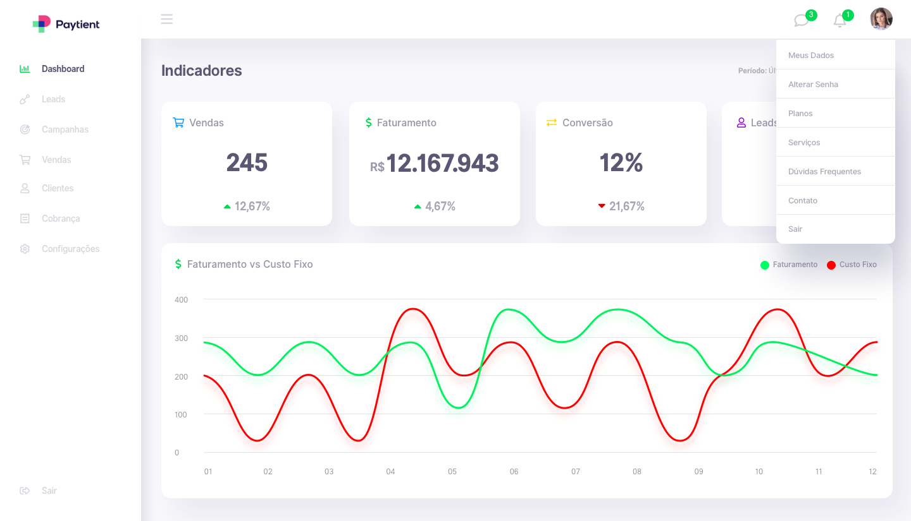
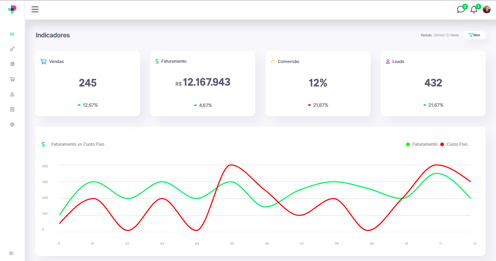
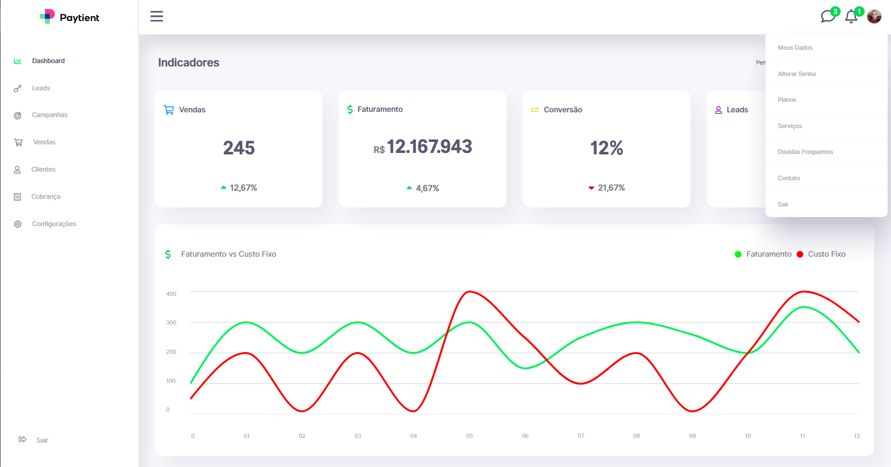
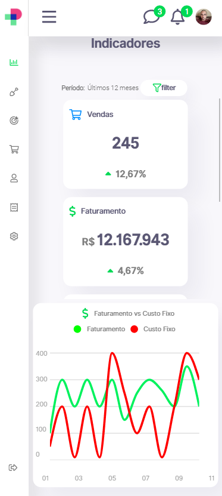
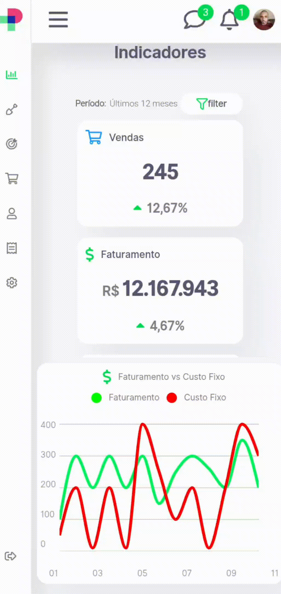

<div align="center" style="text-decoration: none; font-size: 2vh; font-family: 'Segoe UI', Tahoma, Geneva, Verdana, sans-serif; color: #fff">
    <h1 align="center">
        <br/><br/><br/>
    </h1>
</div>

O desafio é recriar uma página web utilizando **ReactJS** seguindo o modelo:
<br />


<br />
## 🛠 Stack utilizada
A página foi criada em ReactJS com CRA.

* [__*ReactJS*__](https://reactjs.org/)
* [__*Recharts*__](https://recharts.org/en-US/)
* [__*React-Router-Dom*__](https://v5.reactrouter.com/)
* __*CSS*__ e  __*HTML*__


## Resultado:

* Com o grafico, foi utilizado a lib **Recharts**, com a adição de alguns estilos a parte com CSS. 
* Os demais componentes foram estilizados com CSS.
* As fontes foram indexadas no CSS index.
* Os icones do modelo fazem parte de uma Biblioteca de icones paga, foi necessário recriar uma para poder utilizar esses icones com facilidade.
    - Componente *Imgs* na pasta imgs, recebe:
    ```bash
    { 
        type: O icone, 
        fill: A cor em HEX, 
        height: O tamanho, 
        className: class para estilização com css 
    }
    ```

[preview](https://test-lighthouse-two.vercel.app/)

> Versão final:




> Mobile:







